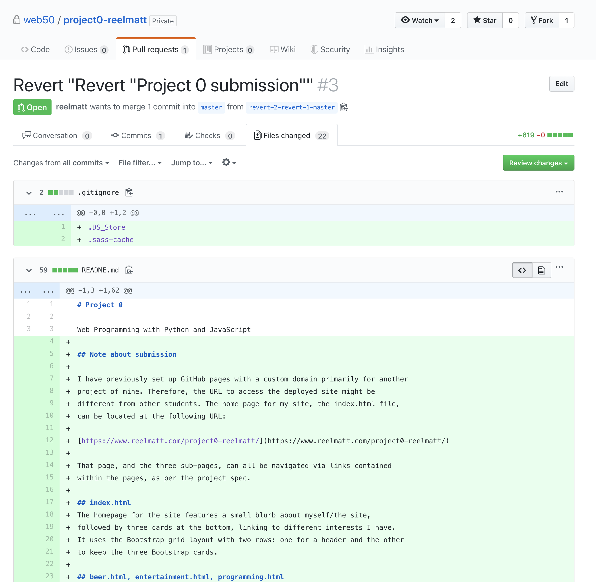

# csci33a
=======
# Project 0

Web Programming with Python and JavaScript

## Note about submission

I have previously set up GitHub pages with a custom domain primarily for another
project of mine. Therefore, the URL to access the deployed site might be
different from other students. The home page for my site, the index.html file,
can be located at the following URL:

[https://www.reelmatt.com/project0-reelmatt/](https://www.reelmatt.com/project0-reelmatt/)

That page, and the three sub-pages, can all be navigated via links contained
within the pages, as per the project spec.

## Note about pull-request submission

After following the instructions for Project 0 to create the pull request for submission, I proceed to hit the green "Merge branch" button. I then saw [this post in the discussion forum](https://us.edstem.org/courses/17/discussion/96) which said *not* to merge the branches. I attempted to revert the change and have the repository reflect the most up-to-date changes. I'm including a screenshot here to show you how things look on my end. Please let me know if there's any submission changes I need to make on my end.

## index.html
The homepage for the site features a small blurb about myself/the site,
followed by three cards at the bottom, linking to different interests I have.
It uses the Bootstrap grid layout with two rows: one for a header and the other
to keep the three Bootstrap cards.

## beer.html, entertainment.html, programming.html
Three subpages, each containing information about a particular interest of mine.
Special elements of note include images, tables, and unordered lists. These
pages are also laid out according to Bootstrap's grid model. On these pages,
there is just one row with two columns which collapse on the 'sm' breakpoint.
These pages also inclue the Bootstrap 'nav' component.

## main.scss (and compiled main.css, main.css.map)
The stylesheet I created to customize some of Bootstrap's styles and elements of
my own. Comments are included for most of the different 'groupings' of styles,
but to call out the specific requirements from the project spec here:

+ Five different CSS properties
    + padding
    + text-align
    + width
    + font-weight
    + margin
    + ...and more
+ Five different types of CSS selectors
    + #id (on #about)
    + .class (on .active)
    + Child selector -- a > b (on a > img)
    + Multiple element selector -- a, b (on td, th)
    + Pseudoelement selector -- a::b (on #about::before)
    + ...and more
+ Mobile-responsive @media query
    + A lot of mobile-responsive styles I would have made myself were already
      handled by Bootstrap.
    + The @media query I included is very similar, but modified, from the
      example in Lecture 1 from the responsive1.html page, to adjust the page
      title based on screen size.
+ SCSS variable
    + $color-theme, used on several elements to give the site a theme
+ SCSS nesting
    + Noted in comments in main.scss
+ SCSS inheritance
    + Noted in comments in main.scss
    + Used for tables and extended for .beers and .programming on their
      respective pages.
